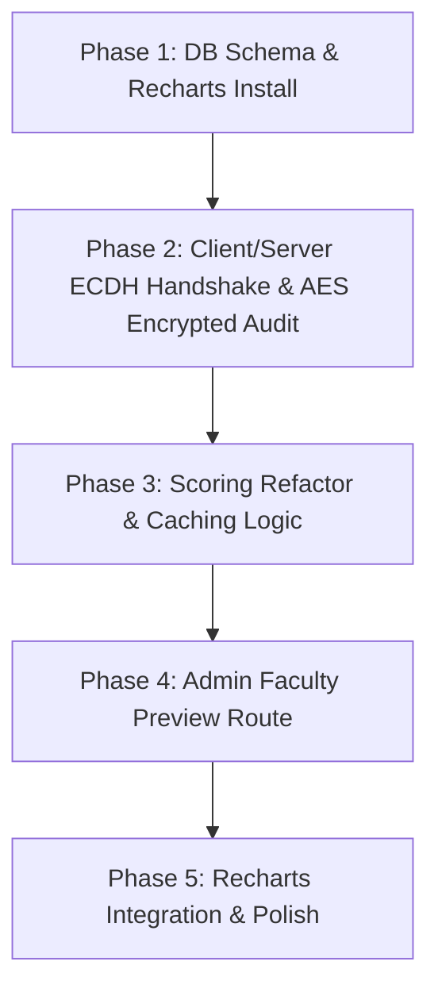

# Technical Design Spec: Analytics, Caching, Faculty Preview, & ECDH-AES Security Redesign

**Date:** 2026-07-09  
**Status:** PROPOSED  
**Author:** Antigravity (Gemini 3.5 Flash)

---

## 1. Executive Summary

This design document outlines the architectural enhancements to the CIT Evaluation System. It introduces a normalized composite scoring mechanism combining math-based scale scores and AI-based qualitative analysis, integrates interactive charts using Recharts, adds an admin-accessible Faculty Preview dashboard, and implements a lightweight, secure hybrid cryptographic protocol (ECDH + AES-256-GCM) alongside an encrypted Audit Log.

---

## 2. System Architecture & Scoring Engine

### 2.1 Composite Scoring Model
Each faculty member receives a composite score from 0 to 100 for a given academic term (Academic Year + Semester). The score is calculated as a weighted blend of:
1. **Scale Score (70% Weight):** Normalized average of answers for `SCALE_0_TO_4` (mapped to 0-100 via $value \times 25$) and `SCALE_1_TO_5` (mapped via $(value - 1) \times 25$).
2. **AI Quality Score (30% Weight):** Gemini AI evaluation of non-scale response elements (`TEXT_LONG`, `RADIO_EXPECTATION`, `CHECKBOX_AREAS`).

$$\text{Composite Score} = (\text{Scale Score} \times 0.7) + (\text{AI Quality Score} \times 0.3)$$

### 2.2 Prisma Schema Modifications
We will introduce `ScoreCache` to avoid heavy recalculations on dashboard renders:

```prisma
model ScoreCache {
  id              String    @id @default(cuid())
  professorId     String
  academicYear    String
  semester        String
  scaleScore      Float?    // Calculated mathematically (0-100)
  aiQualityScore  Float?    // Evaluated via Gemini (0-100)
  compositeScore  Float?    // Weighted final score
  isStale         Boolean   @default(true)
  lastComputedAt  DateTime?
  professor       Professor @relation(fields: [professorId], references: [id], onDelete: Cascade)

  @@unique([professorId, academicYear, semester])
}

// Update Professor model in schema.prisma to include relation:
// scoreCaches ScoreCache[]
```

We will also update `AuditLog` to store encrypted administrative logs:

```prisma
model AuditLog {
  id             String   @id @default(cuid())
  encryptedEvent Bytes    // AES-256-GCM encrypted JSON payload
  iv             Bytes
  authTag        Bytes
  eventType      String   // Plaintext index: USER_ELEVATION, CONFIG_UPDATE, TEMPLATE_ACTIVATE, etc.
  actorEmail     String   // Plaintext index for filtering
  createdAt      DateTime @default(now())

  @@index([eventType, createdAt])
}
```

### 2.3 Caching & Invalidation Flow
- **Scale Scores:** Computed synchronously in database transactions when student evaluations are submitted.
- **AI Quality & Composite Scores:** Computed lazily on the first view (by admin or faculty) for that term.
- **Invalidation:** When a new `Evaluation` is submitted for a professor, academic year, and semester, the corresponding `ScoreCache.isStale` flag is set to `true`. Next read triggers a background computation task to refresh the AI score and composite score, then flips `isStale` back to `false`.

---

## 3. Interactive Charts (Recharts)

To replace visual placeholders, we will install `recharts` and develop five reusable components using Tailwind-integrated shadcn styling.

### 3.1 Chart Inventory
1. **RadarClusterChart (`/components/charts/RadarClusterChart.tsx`):**
   - Renders evaluation scores grouped by criteria clusters (e.g., "Instructional Skills", "Communication").
   - Displays on Faculty Dashboard and Admin Faculty Preview.
2. **SectionBarChart (`/components/charts/SectionBarChart.tsx`):**
   - Displays evaluation scores broken down by class section (e.g., "4-A", "3-B").
   - Uses color thresholds (Green: $\ge 80$, Amber: $60-79$, Red: $< 60$).
3. **FacultyRankingChart (`/components/charts/FacultyRankingChart.tsx`):**
   - Horizontal bar chart showing sorted faculty rankings in the Admin Dashboard.
   - Colored dynamically by department.
4. **DepartmentDonutChart (`/components/charts/DepartmentDonutChart.tsx`):**
   - Shows overall department performance distribution.
5. **HistoricalTrendChart (`/components/charts/HistoricalTrendChart.tsx`):**
   - Line chart charting a professor's composite score progression over semesters.

---

## 4. Admin Faculty Preview Dashboard

We will introduce a new dynamic route: `/app/(admin)/admin/faculty/[professorId]/page.tsx`.

### 4.1 UI Layout
- **Breadcrumbs:** Navigates back to Department / Faculty Management.
- **Alert Banner:** Prominently alerts the admin that they are in preview mode.
- **Header:** Displays Name, Email, Department, and current active term statistics.
- **Main Grid:**
  - Column 1: `RadarClusterChart` and `SectionBarChart`.
  - Column 2: `HistoricalTrendChart` and the Gemini AI summary narrative block.
- **AI Controls:** Admin-facing "Regenerate AI Analysis" button to trigger a recalculation bypassing cache if necessary.
- **Raw Audit Feed:** A sub-table listing evaluation submission dates and associated sections (fully anonymized, omitting student emails).

---

## 5. Security & Ephemeral ECDH + AES Handshake

To satisfy academic requirements without degrading mobile student client performance, we implement a hybrid cryptographic handshake using the **Web Crypto API** (client) and Node.js **crypto module** (server).

### 5.1 Crytographic Handshake Protocol

```
Student Client (Browser)                             Server (Next.js)
      │                                                     │
      │   1. GET /api/crypto/session                        │
      │  ────────────────────────────────────────────────>  │
      │                                                     │ Generate P-256 ECDH Keypair (S)
      │                                                     │ Save S_private in server-side session
      │   2. Responds with { S_public, sessionId }          │
      │  <────────────────────────────────────────────────  │
      │                                                     │
      │ Generate P-256 ECDH Keypair (C)                     │
      │ Derive SharedSecret = ECDH(C_private, S_public)     │
      │ Derive AESKey = HKDF(SharedSecret, salt, info)      │
      │ Encrypt payload using AES-256-GCM(AESKey)           │
      │                                                     │
      │   3. POST /api/evaluations/submit                   │
      │      Body: {                                        │
      │        encryptedPayload,                            │
      │        iv,                                          │
      │        authTag,                                     │
      │        C_public,                                    │
      │        sessionId,                                   │
      │        ...plaintextFields                           │
      │      }                                              │
      │  ────────────────────────────────────────────────>  │
      │                                                     │ Fetch S_private via sessionId
      │                                                     │ Derive SharedSecret = ECDH(S_private, C_public)
      │                                                     │ Derive AESKey = HKDF(SharedSecret, salt, info)
      │                                                     │ Decrypt encryptedPayload with AES-256-GCM
      │                                                     │ Write plain answers to DB
      │                                                     │ Write encrypted record to SecureEvaluation
      │                                                     │ Evict session crypto key
      │   4. Respond with { success: true }                 │
      │  <────────────────────────────────────────────────  │
```

- **ECDH Parameters:** Curve P-256 (secp256r1).
- **AES Parameters:** AES-256-GCM (12-byte IV, 16-byte authentication tag).
- **Fallback / Isolation:** Database storage for operational queries (scoring, tables, charts) remains unencrypted in standard tables (`Evaluation`, `Answer`), ensuring normal analytical performance. The `SecureEvaluation` table acts as a cryptographically verifiable secure audit trail of raw submissions.

### 5.2 Encrypted Administrative Audit Log
All administrative events will be encrypted using standard server-side AES-256-GCM with a persistent key (`process.env.AUDIT_LOG_KEY`). When the admin opens the Activity & Audit console, the server decrypts the records on-the-fly and presents them securely in the browser.

---

## 6. Implementation Stages & Phases



1. **Phase 1: Foundation & Dependencies**
   - Apply Prisma schema migrations.
   - Install `recharts` dependency.
2. **Phase 2: Ephemeral Cryptography & Logging**
   - Set up `/api/crypto/session` route.
   - Implement client-side wrapper utility for Web Crypto ECDH key derivation.
   - Write server-side decrypt actions and AES-256-GCM encryption helpers for `AuditLog`.
3. **Phase 3: Scoring & AI Integration**
   - Refactor Gemini AI prompt logic in `app/actions/ai.ts` to output numerical evaluation scores.
   - Add background caching, invalidation triggers on submission, and `ScoreCache` reads.
4. **Phase 4: Faculty Preview Page & Navigation**
   - Implement the `/admin/faculty/[professorId]` dashboard.
   - Add links to names in `FacultyDepartmentManagement` table rows.
5. **Phase 5: Charts & UI Polish**
   - Construct charting components.
   - Replace placeholders in Faculty Dashboard and Admin Dashboard.
   - Perform end-to-end integration tests.
