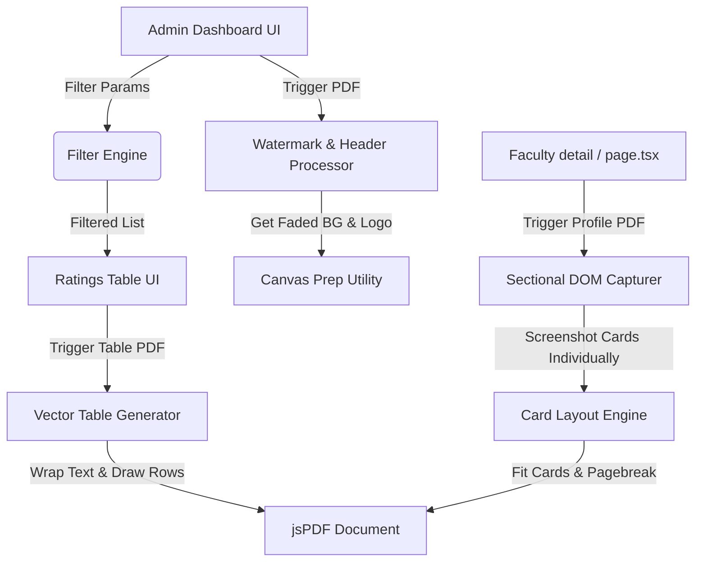

# Design Spec: PDF Export Enhancements & Advanced Search

## 1. Goals & Requirements
The goal of this project is to fix PDF layouts getting cut off, enhance the design of all exported PDFs to follow University of the Assumption (UA) branding, and replace the basic education level filters in the Ratings Ledger with a fully featured Advanced Search panel.

### Core Deliverables:
1. **UA Branded PDF Watermark & Styling**:
   - Incorporate a faded/semi-transparent background watermark on every page using `public/bg.jpg` (lightened to ~8% opacity for text readability).
   - Draw an official header band with the UA logo (`public/ua-logo.png`) and University name in Navy Blue (`#0B2F64`) and Gold (`#D4AF37`) accent stripes.
   - Include page numbering ("Page X of Y") and generation timestamps in the footer of every page.
2. **Vector-wrapped Ledger Tables**:
   - Redesign the tables in Ratings, Attendance, and Audit Logs so they fit perfectly within the page width without clipping or raw string truncation.
   - Implement dynamic text wrapping to wrap long text (such as long emails or section lists) onto new rows.
3. **Card-by-Card Profile Export (No Splits)**:
   - Refactor `exportFacultyPDF` in `lib/exports.ts` to capture individual component nodes (Header, charts, AI summary, comments) separately.
   - Construct the PDF page layout dynamically, packing these cards onto pages sequentially and inserting page breaks *between* cards to prevent slicing text/charts in half.
4. **Ratings Ledger Advanced Search**:
   - Replace the educational level tab filters (`All` / `College`) with a search input (by name or email) and a collapsible Advanced Search panel.
   - Enable filters for Education Level (`COLLEGE`, `BASIC_ED`), specific Departments (e.g. "College of Computer Studies"), and Sections.

---

## 2. Architecture & Technologies
- **PDF Generation**: Client-side `jspdf` and `html2canvas` for browser-based rendering.
- **Image Pre-processing**: HTML Canvas wrapper to dynamically load images (`bg.jpg`, `ua-logo.png`), apply opacity/scaling, and convert them to Base64 data URLs for seamless `jsPDF` integration.
- **Filtering Logic**: React state hooks to filter the local rankings list in real time using concurrent filters.

---

## 3. Detailed Component Design

### A. Watermark & Branding Utility
We will create a helper function that loads local image paths and returns faded/resized versions to avoid bloated file sizes and preserve document readability.
- **Watermark**: Draw `bg.jpg` onto an off-screen canvas, apply `globalAlpha = 0.08`, and convert to PNG.
- **Logo**: Scale `ua-logo.png` to fit the PDF header (~12mm width).

### B. Custom Vector Table Generator (Ledger Exports)
Instead of drawing static coordinates, the `exportToPDF` function in `app/(admin)/admin/page.tsx` will be rebuilt:
1. **Column Calculation**: Map column widths based on headers and document size (A4 is 210mm wide).
2. **Text Wrapping**: Measure string widths using `doc.getTextWidth()`. If a string exceeds its column width, split it into an array of lines and calculate the required height for the row.
3. **Multi-page Spanning**: Draw rows and check the vertical offset `y`. If `y > pageHeight - margin`, draw the footer, call `doc.addPage()`, draw the header/watermark, and reset `y` to the top margin.

### C. Sectional DOM Capture (Faculty Profile Reports)
Refactor `exportFacultyPDF` in `lib/exports.ts`:
1. Query DOM nodes: `#report-header`, `#report-charts`, `#report-sentiment`, `#report-comments`.
2. Generate canvas images for each section.
3. Track remaining height on the current PDF page. If a card's scaled height exceeds the remaining height, trigger a page break, insert header/watermark/borders, and place the card at the top of the new page.

### D. Advanced Search Panel (Ratings Ledger)
Add these filtering parameters to `app/(admin)/admin/page.tsx`:
- `ratingsSearch` (text input: search by name/email).
- `selectedRatingsDepts` (multi-select checklist of departments).
- `selectedRatingsLevels` (checkboxes: College / Basic Education).
- `isRatingsAdvancedSearchOpen` (toggle visibility of the filter panel).

---

## 4. Verification and Testing
- **Compilation Check**: Run `npm run build` to verify types and module resolution.
- **Visual Check**: Open the browser console and generate a PDF to verify:
  1. Watermark opacity and placement are correct.
  2. Text wrapping inside tables does not overflow or truncate awkwardly.
  3. Charts and AI summary blocks are not split in half across page boundaries.
- **Functional Check**: Verify searching and filtering works concurrently for the Faculty Ratings Ledger.
